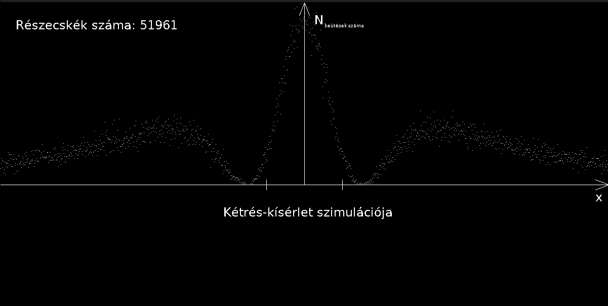

# Quantum Double-Slit Experiment Simulation

 
 
### This project was made as part of the Programming 2 course during my second semester.

## Introduction

It's computational implementation of the famous quantum double-slit experiment using Numerical Probability methods, demonstrating wave-particle duality through numerical simulation. The system models the probability distribution of particle impacts on a detection screen after passing through two slits. It also makes an animation of the scattering electrons (SDL). 

### Requirements
- C++ compiler
- SDL2 and SDL2_ttf libraries

## Usage

1. **Build the project:**
   - Open in VS Code and use the task "Build All C++ Files with SDL"
   - Or manually: `g++ simulation/*.cpp -o main -lSDL2main -lSDL2 -lSDL2_ttf`

2. **Run the simulation:**
   - Execute: `./main`
   - Enter the distance between slits (l) when prompted
   - Enter the distance from slits to screen (d) when prompted

3. **View the animation:**
   - A window will open showing the particle distribution animation
   - The simulation runs until all particles are simulated
   - Close the window to exit
